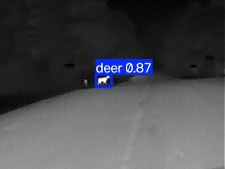
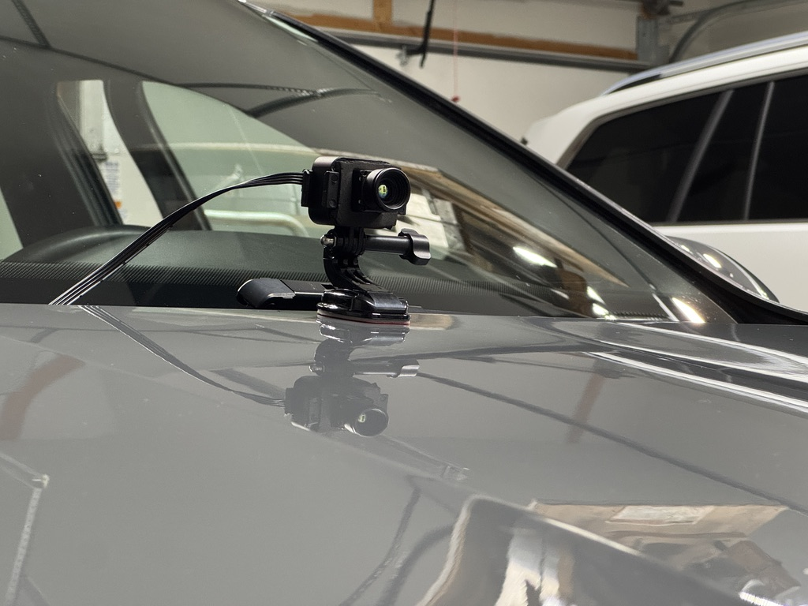
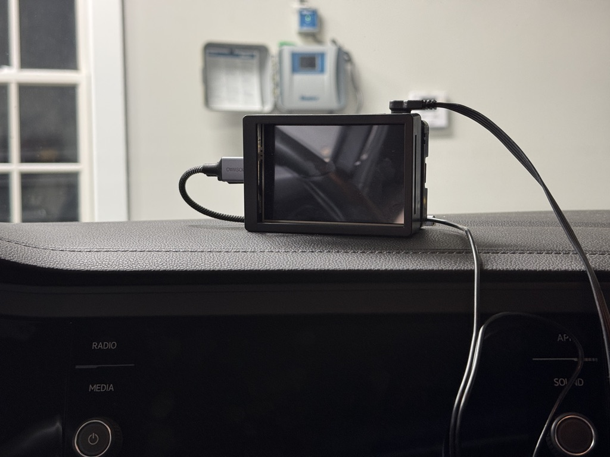
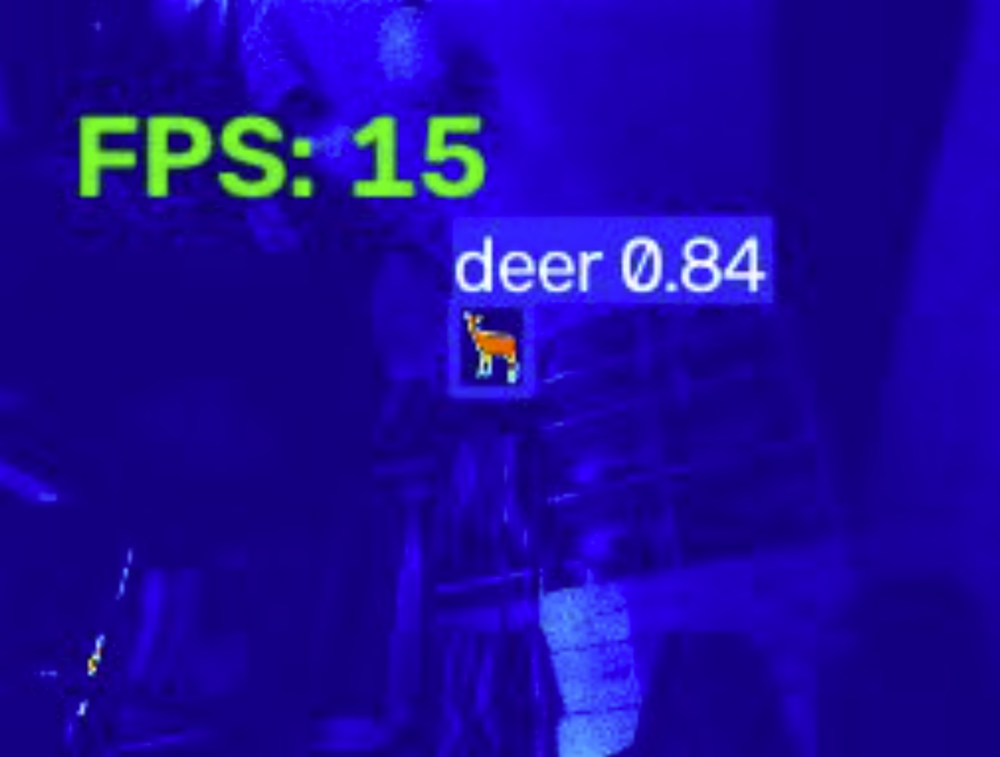
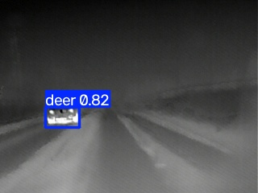

# Thermal Deer Detection Driving Aid for Reducing Rural Animal-Vehicle Collisions

A budget real-time deer detection for night driving with a 256×192 thermal camera and a Raspberry Pi 4
mounted in a car, running a YOLO26n detector at ~15 FPS on CPU, with an audible alert and LCD screen for the driver.

<p align="center">
  <br>
  <em>Live road test with a deer correctly detected at 0.87 confidence.</em>
</p>

---

## Why
I'm from a small township in rural Minnesota. Because of the distinct lack of people, deer often run across the road when cars drive by - my family alone has hit multiple deer in the past couple of years. So, to help protect rural drivers facing the same odds, I've built a device that mounts to any car and warns drivers in these situations.

Deer–vehicle collisions happen overwhelmingly at dawn, dusk, and at night, which is when visibility is the lowest. Thermal imaging can help in these scenarios because a deer shows as a warm object against a cold background. Some high-end vehicles can be optioned with such thermal aid systems for thousands of dollars, so I wanted to see how close a Raspberry Pi and a cheap thermal camera could get for under $500 (including the price of the Pi I already owned). The goal of this project was to find out whether a useful version of such a system can be created on hardware a student like myself can afford. 

---

## How it works

```
Thermal camera (256×192, UVC, 9.1mm lens)
        │
        ▼
  OpenCV capture  ──►  YOLO26n (NCNN)  ──►  detections
                                              │
                          ┌───────────────────┴───────────────────┐
                          ▼                                       ▼
                   LCD live feed                          Audio alert (mpg123)
                   (3.5" touchscreen)                     via USB sound adapter
```

The model was trained locally on an RTX 4070 (PyTorch + CUDA).

- **Trained at the sensor's native resolution.** The camera outputs 256×192, so there was no
   reason to train or infer at much larger resolutions and this matching of input size cut compute.
- **Exported to NCNN.** ARM-optimized inference; this is what made ~15 FPS achievable on a
   Pi 4 CPU with no accelerator.


| | |
|---|---|
| Detector | YOLO26n, trained at 256×192 (native sensor resolution) |
| Inference runtime | NCNN export, OpenCV capture |
| Platform | Raspberry Pi 4 (4 GB), CPU only |
| Throughput | ~15 FPS consistently|
| Field validation | Detected live deer on rural roads at night, up to 0.92 confidence |

---

## Hardware

| Part | Notes |
|---|---|
| Raspberry Pi 4, 4 GB | Runs headless; LCD driven via `xinit` |
| 256×192 thermal FPV camera | USB/UVC, with 9.1mm lens |
| 3.5" touchscreen LCD | Driver-facing live feed |
| 12V → 5V converter | Car power cigarette-lighter charger to USB-C|
| USB → 3.5 mm audio adapter | Required to mitigate LCD interference with the Pi's onboard audio jack |
| Speaker | Output beep tone to alert drivers |
| Mount/clamp | GoPro camera mount (sensor retrofitted into it) with 3M VHB adhesive |

<p align="center">
  <br>
  <em>Front hood mount of the camera</em>
</p>


<p align="center">
  <br>
  <em>LCD screen + audio alert system for drivers</em>
</p>

---

## Engineering notes

### Testing before the hardware arrived

The thermal camera took weeks to ship. Rather than wait, I built a stand-in: a normal webcam
plus an OpenCV colormap that maps brightness to a thermal-style palette. I pointed the camera at a white deer cutout on an OLED phone screen. On an OLED, the black background emits nothing and the white shape is bright, so under a brightness-as-temperature mapping, it behaves like a warm object against a cold background. That was enough to develop and profile the entire capture → inference → alert pipeline on the Pi, and it turned out to predict real-world throughput accurately: 15 FPS on the fake feed, 15 FPS on the real one.

<p align="center">
  <br>
  <em>Bench testing: phone-screen "deer" detected at 0.84, 15 FPS on the Pi.</em>
</p>

### False positives from oncoming traffic

The obvious failure for a thermal detector on a road is oncoming cars. The engines can appear as a warm blob and be incorrectly identified as a deer. I pointed the camera at my car, which has a see-through grill, and the only region that lit up was the A/C condenser/radiator. Usually for cars without see-through grills, the engine heat was less of a problem and was better than I expected.

A potential fix is to combine the thermal feed with a visible-light camera and use brightness as a differentiator: headlights are far brighter than anything a deer reflects, so a detection that is both hot and extremely bright in the visible band can be suppressed. The hard part would be the threshold, however. A deer standing in your own headlights is bright too, just not as bright as headlights would be. Also, this would only be benefical during early morning or at night when headlights are on. Granted, those times are when there are the most deer and drivers stand to gain the most benefit from this system at such times.

<p align="center">
  <br>
  <em>An example of a false positive from an oncoming car</em>
</p>


---

## Limitations of this Prototype

- Single class (`deer`) and no distance estimation
- Validated on a small number of night drives on rural roads in
  my home state of Minnesota
- The trained model inherits whatever biases exist in the source dataset; I have not
  thoroughly tested against other warm animals (dogs, cast, coyotes, etc).

---

## Credits

- Initial thermal deer dataset: [Deer Computer Vision Model by @deer-cyqbv on RoboFlow Universe](https://universe.roboflow.com/project/deer-m1b0d/dataset/3)
- Detector: [Ultralytics YOLO26](https://github.com/ultralytics/ultralytics)
- Related work: Puppala et al., *Real-time Deer Detection and Warning in Connected Vehicles via
  Thermal Sensing and Deep Learning*, [arXiv:2509.18779](https://arxiv.org/abs/2509.18779)

## License

Object detection uses [Ultralytics YOLO](https://github.com/ultralytics/ultralytics),
licensed under [AGPL-3.0](https://www.gnu.org/licenses/agpl-3.0.html).
This project is therefore likewise released under AGPL-3.0.
